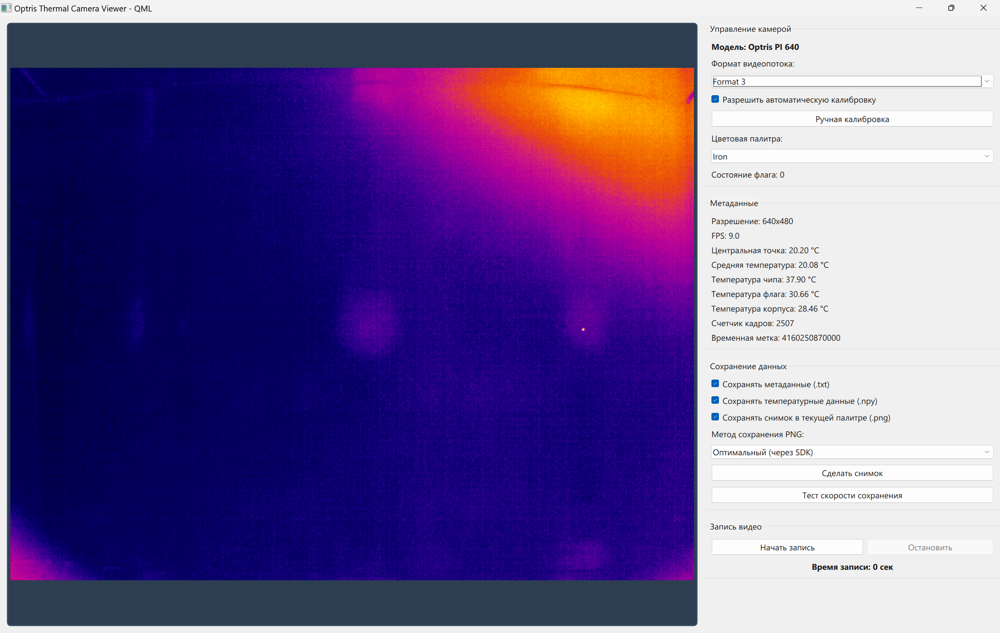

# 🔥 optris-camera-debug


Инструмент для отладки и работы с тепловизионными камерами Optris через библиотеку libirimager.dll. Приложение предоставляет графический интерфейс для вывода изображения с тепловизора и управления настройками.

Инструмент для отладки и работы с тепловизорами Optris (серии **PI** и **Xi**) через официальный [OTC SDK](https://github.com/Optris/otcsdk_downloads).
На текущем этапе приложение ориентировано на **Windows 10/11 (AMD64)**. В перспективе планируется поддержка Linux (Ubuntu, Arch) как на AMD64, так и на ARM64.

## ✨ Основные возможности

- 📷 Вывод изображения с тепловизора в реальном времени (PySide6 + QML)
- 🎨 Применение цветовых палитр SDK
- 🌡️ Мониторинг температур: центральная точка, средняя по кадру, чип/флаг/корпус
- ⚙️ Управление камерой: автоматическая/ручная калибровка (флаг), переключение видеорежимов
- 💾 Сохранение данных: метаданные (`.txt`), температурные матрицы (`.npy`), скриншоты (`.png`)
- 🎥 Запись видеопотока в `.avi` (MJPG)
- 🧪 Встроенный тест скорости сохранения

## Демонстрация работы

Приложение предоставляет интуитивно понятный интерфейс с изображением в левой части и панелью управления в правой части:



## 📁 Структура проекта

optris-camera-debug/  
├── 📁 icons/ ---------------------- Иконки приложения
├── 📁 screenshots/ ---------------- Скриншоты для документации  
├── 📄 .gitignore ------------------ Исключения git  
├── 📄 Formats.def ----------------- Файл определений форматов камер (Optris SDK)  
├── 📄 generic.xml ----------------- Конфиг подключения: параметры камеры, автофлаг, фокус  
├── 📄 libirimager.dll ------------- DLL-библиотека Optris SDK (Windows AMD64)  
├── 📄 LICENSE --------------------- Лицензия GPLv3  
├── 📄 main.qml -------------------- Интерфейс приложения на QML  
├── 📄 optris_camera_debug_tool.py - Точка входа: логика камеры + QML-контроллер  
├── 📄 README.md ------------------- Документация (этот файл)  
└── 📄 requirements.txt ------------ Зависимости Python для pip install  

## 🚀 Быстрый старт

### Предварительные требования

- **ОС:** Windows 10 / 11 (x64)
- **Python:** 3.10+
- **Библиотека:** `libirimager.dll` 
  - При запуске из исходников: должна лежать в корне проекта
  - В релизном `.exe`: вшивается внутрь, внешняя зависимость не требуется

### Установка зависимостей

```bash
# Создаём и активируем виртуальное окружение (опционально, но рекомендуется)
python -m venv venv
source venv/Scripts/activate  # Windows CMD/PowerShell: venv\Scripts\activate

# Устанавливаем зависимости
pip install -r requirements.txt
```

### Запуск приложения

```bash
python optris_camera_debug_tool.py
```

## 📦 Версионирование и разработка

- Используется [SemVer](https://semver.org) (`vMAJOR.MINOR.PATCH`)
- История коммитов следует спецификации [Conventional Commits](https://www.conventionalcommits.org/)
- Релизы сопровождаются запакованными `.exe` (через PyInstaller)

## 🗺️ Roadmap

- [ ] [Переход на официальные Python-биндинги](https://github.com/RadioPizza/optris-camera-debug/issues/4)
- [ ] [Архитектурное разделение файлов проекта по паттерну Model-View-Presenter](https://github.com/RadioPizza/optris-camera-debug/issues/5)
- [ ] [Реализация функции записи в RAVI серии термограмм](https://github.com/RadioPizza/optris-camera-debug/issues/6)
- [ ] [Реализация функции записи в numpy-массив серии термограмм](https://github.com/RadioPizza/optris-camera-debug/issues/7)
- [ ] [Поддержка Linux на AMD64](https://github.com/RadioPizza/optris-camera-debug/issues/8)
- [ ] [Поддержка Linux на ARM64](https://github.com/RadioPizza/optris-camera-debug/issues/9)
- [ ] [Автоматический парсинг `Formats.def` из SDK для определения профилей камер](https://github.com/RadioPizza/optris-camera-debug/issues/3)
- [ ] [Реализация применения определенных профилей (разрешение + FPS)](https://github.com/RadioPizza/optris-camera-debug/issues/3)
- [ ] [Автодетект подключённых устройств и выбор целевой камеры](https://github.com/RadioPizza/optris-camera-debug/issues/10)
- [ ] [Оптимизация для повышения скорости работы приложения и FPS](https://github.com/RadioPizza/optris-camera-debug/issues/11)
- [ ] [Настройка автоматической проверки линтерами](https://github.com/RadioPizza/optris-camera-debug/issues/12)
- [ ] [Написание тестов](https://github.com/RadioPizza/optris-camera-debug/issues/14)

